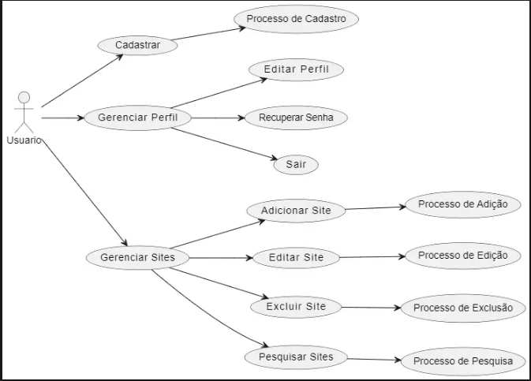
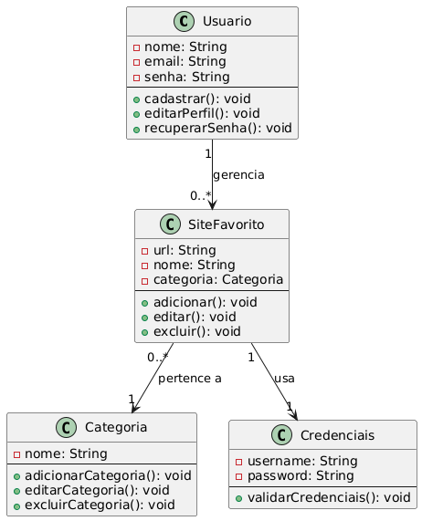
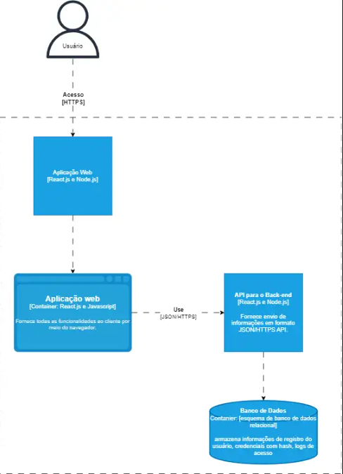
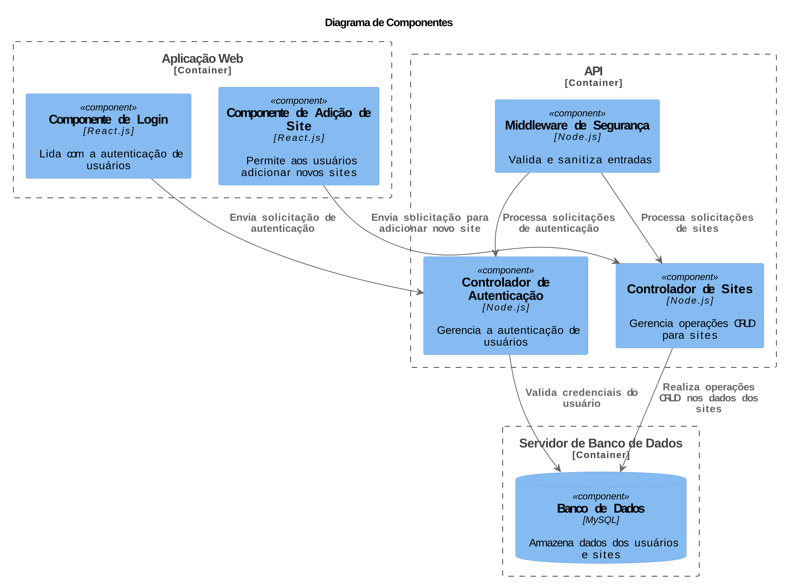

# Descrição do Projeto

Este projeto é uma aplicação web desenvolvida para oferecer aos usuários uma solução intuitiva e segura para o armazenamento e gerenciamento de credenciais. Através de uma interface amigável, os usuários podem salvar suas credencias de seus sites favoritos, assegurando um acesso rápido e seguro a esses sites quando necessário. A plataforma se destaca pela implementação de medidas robustas de segurança, como criptografia de dados e proporcionando uma experiência de uso eficiente e conveniente.

## Casos de Uso

O diagrama de casos de uso apresenta as principais interações que um usuário pode realizar no sistema:

- **Cadastrar**: Permite ao usuário criar uma nova conta na plataforma.
- **Gerenciar Perfil**: O usuário pode editar seu perfil, recuperar sua senha e sair da aplicação.
- **Gerenciar Credenciais**: Inclui funcionalidades para adicionar, editar, excluir e pesquisar sites favoritos.

Essas interações definem o escopo principal do sistema e representam os principais fluxos de trabalho.

## História de Usuário

Como um usuário que utiliza frequentemente diferentes navegadores e precisa acessar rapidamente os sites que mais frequentados:

- Eu quero poder armazenar e organizar meus sites favoritos em uma plataforma confiável.
- Eu quero que a plataforma armazene minhas credenciais de acesso de forma segura.
- Eu preciso que a aplicação esteja disponível em múltiplos dispositivos e navegadores para que eu possa acessar meus dados de qualquer lugar.

## Requisitos Funcionais

1. **RF01 - Cadastro de Usuário**: Permitir que os usuários se cadastrem na plataforma fornecendo informações básicas como nome, e-mail e senha.
2. **RF02 - Adição de Sites Favoritos**: Possibilitar aos usuários adicionar novos sites favoritos à plataforma, informando o URL do site e suas credenciais de acesso.
3. **RF03 - Edição de Sites Favoritos**: Permitir que os usuários editem as informações de sites favoritos já cadastrados, incluindo URL, credenciais de acesso e categorização.
4. **RF04 - Exclusão de Sites Favoritos**: Possibilitar aos usuários excluir sites favoritos que não desejam mais armazenar na plataforma.
5. **RF05 - Organização em Categorias**: Permitir que os usuários organizem seus sites favoritos em categorias personalizadas para facilitar o acesso e a navegação.
6. **RF06 - Pesquisa de Sites Favoritos**: Oferecer aos usuários a capacidade de pesquisar sites favoritos por nome, URL ou categoria.
7. **RF07 - Recuperação de Senha**: Permitir que os usuários redefinam suas senhas caso as esqueçam, utilizando um processo de recuperação seguro.
8. **RF08 - Segurança**: Garantir que todas as informações dos usuários sejam armazenadas de forma segura e protegida por técnicas de criptografia.

## Requisitos Não Funcionais

1. **RNF01 - Usabilidade**: Desenvolver uma interface de usuário intuitiva e amigável para garantir uma experiência de uso agradável.
2. **RNF02 - Desempenho**: Assegurar que a plataforma tenha um desempenho rápido e responsivo, minimizando o tempo de resposta para todas as operações.
3. **RNF03 - Disponibilidade**: Garantir alta disponibilidade da plataforma, com tempo de inatividade mínimo e manutenções planejadas durante períodos de baixo tráfego.
4. **RNF04 - Escalabilidade**: Projetar a plataforma para escalar facilmente, suportando um grande número de usuários e volumes de dados crescentes ao longo do tempo.

## Diagrama de Classes

O diagrama de classes ilustra a estrutura de dados e os relacionamentos entre as principais entidades no sistema. Isso inclui classes como `Usuario`, `SiteFavorito`, `Categoria`, e `Credenciais`, destacando os atributos e métodos principais de cada classe. Esse diagrama ajuda a visualizar como os dados são estruturados e como as entidades interagem dentro do sistema.

## Modelo de Dados

O modelo de dados define a estrutura do banco de dados relacional utilizado pela aplicação. As principais tabelas incluem:

- **Usuario**: Armazena as informações dos usuários, como nome, e-mail, e senha (com hash).
- **SiteFavorito**: Contém as URLs dos sites favoritos dos usuários, além de referências às credenciais associadas.
- **Categoria**: Permite que os sites sejam organizados em categorias personalizadas.
- **Credenciais**: Armazena de forma segura as credenciais de acesso (usuário e senha) associadas a cada site favorito.

Essas tabelas são interligadas por chaves estrangeiras para garantir a integridade dos dados e facilitar consultas complexas.

## Modelo C4

### Diagrama de Contêineres

Aqui, detalhamos os principais contêineres que compõem o sistema, como aplicações web, serviços de backend, bases de dados, etc. Este nível de detalhe ajuda a entender como os diferentes componentes do sistema estão distribuídos e interagem entre si.

### Diagrama de Componente

Este diagrama foca nos componentes internos de cada contêiner, detalhando como eles são organizados e como colaboram para fornecer as funcionalidades do sistema. Componentes podem ser classes, bibliotecas ou módulos.

## Considerações de Design

A plataforma foi projetada com foco em segurança, usabilidade e escalabilidade. Seguindo padrões de design como MVC (Model-View-Controller) e arquitetura baseada em microserviços, a aplicação é modular e fácil de manter. Os modelos C4 foram aplicados para detalhar a arquitetura do sistema em diferentes níveis, desde o contexto até o nível de código, garantindo uma visão coesa e compreensiva de toda a estrutura.

## Tecnologias Utilizadas

- **Frontend**: React.js, HTML5, CSS3
- **Backend**: Node.js, Express.js
- **Banco de Dados**: MySQL
- **ORM**: Sequelize
- **Controle de Versão**: Git/GitHub
- **Ferramentas de Desenvolvimento**: Visual Studio Code, Postman
- **Gestão de Projeto**: Trello (metodologia ágil Kanban)

## Considerações de Segurança

A segurança é uma prioridade, com medidas como validação e sanitização de entradas, criptografia de dados, e políticas de senha forte implementadas para proteger os usuários e suas informações.

## Plano de desenvolvimento

O plano de desevolvimento foi montado antes do inicio do desenvolvimento do projeto e com o decorrer do desenvolvimento está sendo acrescentado novas demandas no board caso elas não constarem no escopo.

[Board no Trello](https://trello.com/invite/b/667f31bf02e809ab0fd22d43/ATTIb5d58c6dfff3b17fb84707c2b3a3d37b6408DC9A/portifolio)